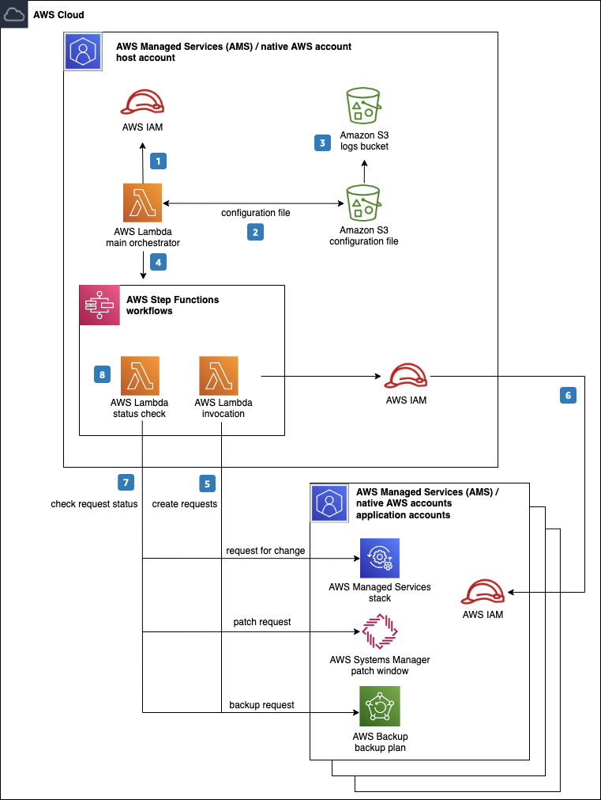

# Deprecation Notice

This AWS Solution has been archived and is no longer maintained by AWS. To discover other solutions, please visit the [AWS Solutions Library](https://aws.amazon.com/solutions/).

# automated-account-configuration
The Automated account configuration is a sample solution to enable operational scale for AWS customers by automating repeatable
steps required before AWS accounts are used for customer workloads. Steps include setting up backups and patching for the
resources within the account.

## On this Page

-   [Architecture Overview](#architecture-overview)
-   [Deployment](#deployment)
-   [Source Code](#source-code)
-   [Creating a custom build](#creating-a-custom-build)

## architecture-overview


The architecture of the solution includes the following key components and workflows:

1. The main_orchestrator AWS Lambda function retrieves the IAM role required to complete the account configuration deployment.

2. This Lambda function then downloads the configuration file stored in the Amazon S3 bucket.

3. The S3 bucket hosting the configuration file logs an event to a dedicated logging S3 bucket.

4. After the configuration file is downloaded, the main_orchestrator Lambda function performs error checks on the inputs and the list of configuration steps. This Lambda function calls the appropriate AWS Step Functions workflow based on the change type defined in the configuration file.

5. AWS Step Functions call the appropriate invocation Lambda function to run the resource creation process in the destination AWS account.

6. The invocation Lambda function assumes the appropriate IAM role in the application AWS account containing the necessary permissions to create stacks.

7. Based on the change type, AWS Step Functions may initiate a follow up status check by calling the status_check Lambda function on a schedule until the process completes.

8. The status_check Lambda function returns the result of the job to AWS Step Functions once the job completes providing a status of the job.

## Deployment
The solution is deployed using a CloudFormation template, for a detailed solution deployment guide, refer to [implementation guide](https://aws.amazon.com/solutions/implementations/automated-account-configuration/).


## source-code

```
|-deployment/
  |-build-s3-dist.sh                                              [ shell script for packaging distribution assets ]
  |-run-unit-tests.sh                                             [ shell script for executing unit tests ]
  |-automated-account-configuration.template                      [ solution CloudFormation deployment template to deploy S3 and IAM Roe ]
  |-automated-account-configuration-step-2.template               [ solution CloudFormation deployment template to deploy tools account policies, Lambda functions and step functions]
  |-automated-account-configuration-step-3.template               [ solution CloudFormation deployment template to deploy tools account IAM role into the application account]
  |-automated-account-configuration-step-4.template               [ solution CloudFormation deployment template to setup trust into the tools accounts]
|-source/
  |-deployment_packages                                           [ Folder containing Lambda function packages ]
  |-models                                                        [ Folder containing AMS service models to enable RFC creation ]
  |-python                                                        [ Folder containing Lambda layer files and functions ]
    | - get_auth.py                                               [ Functions to obtain credentials from the application acount IAM role ]
    | - Utilities.py                                              [ Utility functions to read configurations ]
  |-S3_Files                                                      [ Folder containing multiple subfolders for the solution configuration and source code for lambda functions ]
    | - Account_Configuration                                     [ Folder containing configuration file for the solution to run ]
        | - Account_Config.json                                   [ File containing all the configurtions for the solution ]
    | - functions                                                 [ Folder containing Lambda function code including layer and necessary models ]     
    | - JSON_Template                                             [ Folder containing input to the backup, patch used by Lambda functions in the solution, for more details about AMS CT types please visit https://console.aws.amazon.com/managedservices/docs/managedservices/latest/ctref/what-are-change-types.html]    
  |-Main_Orchestrator.py                                          [ Lambda that acts as the initial point of execution of the solution]
  |-Check_Status_RFC.py                                           [ Lambda function to check the status of an AMS Request For Change ]
  |-Config.ini                                                    [ Configuration file storing values used by Lambda functions ]
  |-Create_RFC.py                                                 [ Lambda function to create AMS Request For Change ]
  |-Create_SR.py                                                  [ Lambda function to create AMS Service Request ]
  |-customer_managed_backup.py                                    [ Lambda function to create a native AWS Backup Plan and vault ]
  |-customer_managed_patch.py                                     [ Lambda function to create a native AWS default patch window]
```

## Creating a custom build

The solution can be deployed through the CloudFormation template available on the implementation under [automated deployment](https://docs.aws.amazon.com/solutions/latest/automated-account-configuration/automated-deployment.html). To make changes to the solution, download or clone this repo, update the source code and then run the deployment/build-s3-dist.sh script to deploy the updated Lambda code to an Amazon S3 bucket in your account.

### Prerequisites

- [AWS Command Line Interface](https://aws.amazon.com/cli/)
- Python 3.8 or later

### 1. Running unit tests for customization

```
cd ./deployment
chmod +x ./run-unit-tests.sh
./run-unit-tests.sh
```

### 2. Create an Amazon S3 Bucket

The CloudFormation template is configured to pull the deployment packages from Amazon S3 bucket in the region the template is being launched in. Create a bucket in the desired region with the region name appended to the name of the bucket (e.g. for us-east-1 create a bucket named my-bucket-us-east-1).
```
aws s3 mb s3://my-bucket-us-east-1
```

> Note: When creating and using buckets it is recommeded to:
- Use randomized names or uuid as part of your bucket naming strategy.
- Ensure buckets are not public.
- Verify bucket ownership prior to uploading templates or code artifacts.


### 3. Build the solution for deployment

- Set environment variables for deployment package S3 bucket, solution name, verions, and region.
  * DIST_OUTPUT_BUCKET - This is the s3 bucket name of the distribution where lambda artfiacts will be uploaded to for the CloudFormation template to pick it up for deployment. The name of the bucket should be provided without `-<region>` (e.g.: my-bucket)
  * SOLUTION_NAME - The name of This solution (e.g.: automated-account-configuration-test)
  * VERSION - The version number of the change
  * REGION - The region where the solution is deployed

```
export DIST_OUTPUT_BUCKET=<s3-bucket-name>
export SOLUTION_NAME=automated-account-config
export VERSION=<my-version>
export REGION=<region-name>
```
-   Create the deployment packages:
```
cd ./deployment
chmod +x ./build-s3-dist.sh
./build-s3-dist.sh $DIST_OUTPUT_BUCKET $SOLUTION_NAME $VERSION
```

> Note: The build-s3-dist script expects the bucket name as one of its parameters, and this value should not include the region suffix.

- Deploy the distributable to the Amazon S3 bucket in your account:
```
aws s3 cp ./global-s3-assets/ s3://$DIST_OUTPUT_BUCKET-$REGION/$SOLUTION_NAME/$VERSION/ --recursive --acl bucket-owner-full-control 
aws s3 cp ./regional-s3-assets/ s3://$DIST_OUTPUT_BUCKET-$REGION/$SOLUTION_NAME/$VERSION/ --recursive --acl bucket-owner-full-control 
```

## Disclaimer
This solution collects anonymous operational metrics to help AWS improve the quality of features of the solution. For more information, including how to disable this capability, please see the [implementation guide](https://docs.aws.amazon.com/solutions/latest/automated-account-configuration/collection-of-operational-metrics.html).

Copyright 2021 Amazon.com, Inc. or its affiliates. All Rights Reserved.

Licensed under the the MIT-0 License. See the LICENSE file. This file is distributed on an "AS IS" BASIS, WITHOUT WARRANTIES OR CONDITIONS OF ANY KIND, express or implied. See the License for the specific language governing permissions and limitations under the License.
